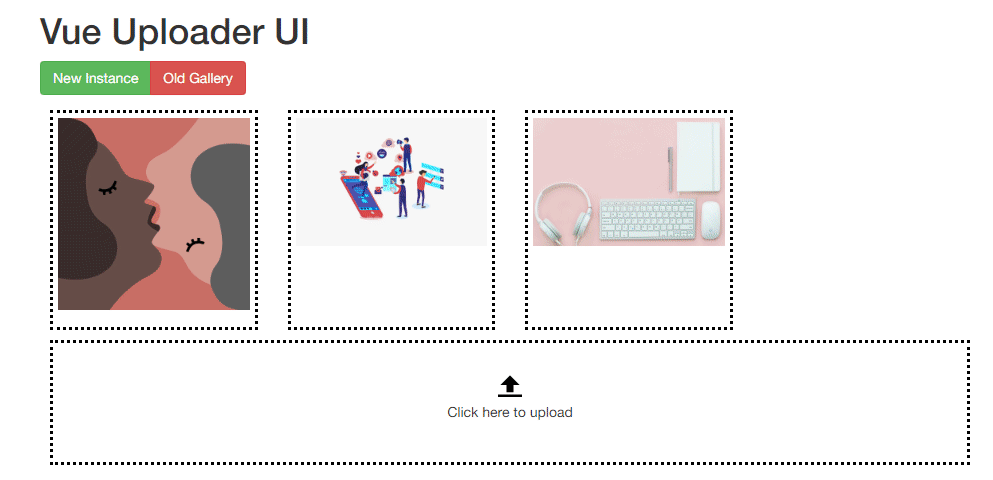

# Vue Simple Uploader - Gallery Uploader

A simple UI for Vue to upload a gallery (images) or files with drag & drop for position arrangement

You can upload:
- Images (including preview mode)
- Files

## Demo

### Online
Coming soon...

### Image



## Built with
- JavaScript 
- Vue 2
- Sortable

### Styling
I'm using Bootstrap 3 (only some basic class), it would be normally fine if you're using Bootstrap (3 or 4).

Next version `0.2.0`, I'll add the standalone styling version.

## Install

### Node
NPM/Yarn:
```bash
npm i vue-simple-gallery-uploader
```

### Browser Component
Pick up the latest build in the [Release](https://github.com/sethsandaru/vue-simple-gallery-uploader/releases) page.

```html
<link href="simple-uploader.min.css" rel="stylesheet">

<script src="vue.min.js"></script>
<script src="vue-uploader.umd.min.js"></script>
```

## Usage

### Node (Basic)
```vue
<template>
    <VueUploader v-model="myFiles"></VueUploader>
</template>
<script>
    import VueUploader from 'vue-simple-gallery-uploader'
    import 'vue-simple-gallery-uploader/dist/simple-uploader.min.css'

    export default {
        components: {
            VueUploader,
            // or if you want do use kebab-case
            // 'vue-uploader': VueUploader
        }
    }
</script>
```

### Browser
Simply use it without a doubt >o<

```html
<vue-uploader v-model="myFiles"></vue-uploader>

<script>
    new Vue({
        //...
        data: {
            myFiles: []
        },
        //...
    })
</script>
```

## Config Options - Component Props
| Props              | Data Type | Description                                                                                                                                                                                                                                                                                                |
|--------------------|-----------|------------------------------------------------------------------------------------------------------------------------------------------------------------------------------------------------------------------------------------------------------------------------------------------------------------|
| limit              | Integer   | Number of files can be uploaded. 0 for unlimited.<br>Default: 0                                                                                                                                                                                                                                            |
| formMode           | Boolean   | If you're using the Component inside `<form>` and you handle the form action like the old fashion way, turn this to "true".<br>Vue-Uploader will created 2 hidden fields: `files[]` and `urls[]` which contain the fileIDs and fileURLs<br>Default: false                                                  |
| fileRules          | String    | The `accept` attribute for the input=file.<br>Default: "image/jpg, image/jpeg, image/png"                                                                                                                                                                                                                  |
| acceptedExtensions | Array     | For validation purpose. To check the file's extension before upload it.<br>Default: ['jpg','jpeg','png']                                                                                                                                                                                                   |
| endpoint           | Object    | API-Endpoint in order to Upload or Delete your image(s).<br>Must be declared like this:   <br>{<br>&emsp;    "upload": "https(s)://< your-host >/< your-path >",<br>&emsp;    "delete": "..."<br>}<br>Note: If the "delete" endpoint is empty/null => When user deleted an image, Vue-Uploader won't make any request. |

## API Information
Vue Simple Gallery Uploader need these REST APIs:
- Upload
- Delete (Optional)

### [POST] Upload API Note

#### Request
Vue Simple Gallery Uploader will include these data and send to you:
```
URL: http(s)://<your-host>/<your-path>
Method: POST
Content-Type: multipart/form-data
Body:
    - file: Binary data
```

#### Response
Success-Response must send the data back like below in order to let the Vue Simple Gallery Uploader works normally:

```json
{
    "fileId": 1,
    "fileURL": "https://your-host/uploads/imagexyz.jpg"
}
```

### [DELETE] Delete File API Note
Vue Simple Gallery Uploader will send a request when users clicked the delete icon:
```
Method: DELETE
URL: http(s)://<your-host>/<your-path>/{fileId}
```

Eg: DELETE https://sethphat.com/api/gallery/delete/51

No response needed.

### Ajax Note
Vue Simple Gallery Uploader is smart enough to find your current Ajax Client in the following order:   
- JQuery Ajax ($.ajax)
- Axios (axios.post && axios.delete)
- fetch API (Final fallback)

### Basic API Implementation
Visit [HERE](./backend). Quick and not very dirty ExpressJS.

## Want to improve?
Feel free to make a fork and create a pull request. I'll review it.

## Demo Images Copyright
- Image by <a href="https://pixabay.com/users/Patricia_Roman-6871627/?utm_source=link-attribution&amp;utm_medium=referral&amp;utm_campaign=image&amp;utm_content=5426977">Patricia Román</a> from <a href="https://pixabay.com/?utm_source=link-attribution&amp;utm_medium=referral&amp;utm_campaign=image&amp;utm_content=5426977">Pixabay</a>
- Image by <a href="https://pixabay.com/users/jmexclusives-10518280/?utm_source=link-attribution&amp;utm_medium=referral&amp;utm_campaign=image&amp;utm_content=5187243">Joseph Mucira</a> from <a href="https://pixabay.com/?utm_source=link-attribution&amp;utm_medium=referral&amp;utm_campaign=image&amp;utm_content=5187243">Pixabay</a>
- Image by <a href="https://pixabay.com/users/LUM3N-1066559/?utm_source=link-attribution&amp;utm_medium=referral&amp;utm_campaign=image&amp;utm_content=2303851">LUM3N</a> from <a href="https://pixabay.com/?utm_source=link-attribution&amp;utm_medium=referral&amp;utm_campaign=image&amp;utm_content=2303851">Pixabay</a>

Thanks all for great works.

## LICENSE
MIT License

Copyright 2020 by Phat Tran aka Seth Phat